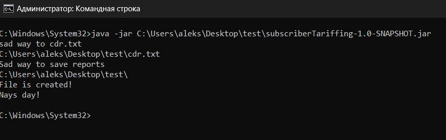

# Проект разработал Садовский А.Д. https://t.me/aleks_wb_spb

# Если у вас возникли вопросы или есть комментарии можете писать мне в Tg(Ссылка выше)
  
# Описание проекта
Проект тарифицирует абонентов. Сгенерированные файлы отчета сохраняются в reports. Наименование отчета - номер абонента.

База данных - файл cdr.txt расположен в папке task.

* [Ссылка на файл](task/cdr.txt)

Для запуска проекта необходимо через командную строку запустить проект.

1. java -jar "Путь к проекту";
2. Указать путь где лежит база данных "cdr.txt";
3. указать путь куда сохраниться папка reports с отчетами;

Фото по запуску намоем ПК.

Проверок на вводимые значения не ставил.

## ЗАДАНИЕ

CDR - сall data record - формат файла, содержащего в себе информацию о времени, стоимости и типа вызова абонента.

В зависимости от вендора, cdr может быть в разном формате, но всегда содержит следующие данные:
- номер абонента (все номера сгенерированы. все совпадения случайны)
- тип вызова (01 - исходящие, 02 - входящие)
- дата и время начала звонка (YYYYMMDDHH24MMSS)
- дата и время окончания звонка
- тип тарфа (см. ниже)

Вот пример готовой записи cdr:

02, 79876543221, 20230321160455, 20230321163211, 11

Тарифов всего 3:
--------
* (06) Безлимит 300: 300 минут - за тарифный период* стоят фиксированную сумму - 100р. Каждая последующая минута - 1р.

Тарифным периодом будем считать все звонки совершенные в текущей выгрузке.

* (03) Поминутный: 1 минута разговора - 1.5 рубля.

* (11) Обычный:
Входящие - бесплатно, исходящие - первые 100 минут по 0.5р/минута, после по тарифу "поминутный".

Конечная задача будет протарифицировать абонентов: т.е. сгенерировать файл отчета для каждого абонента, содержащий в себе номер, индекс тарифа, все совершенные звонки в календарном порядке с выпиской их стоимости по тарифу (для безлимита первые 300 минут - 0р, а с 301 уже расчет), продолжительность звонка, итоговая сумма списания.

Для реализации функционала разрешается использовать только средства стандартной библиотеки java (JDK 11). Система сборки - maven. Приложение должно содержать рабочий метод main() для запуска генератора отчетов. Отчеты собирать в директорию reports в корневой папке проекта.
